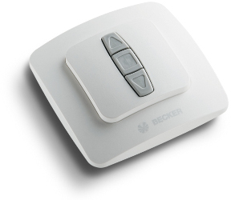
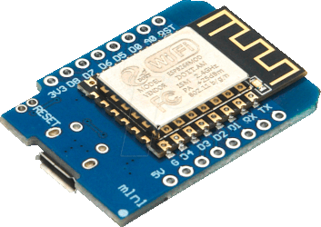

# esp8266-window-shutter

An ESP8266 program to connect 2 Becker Window Shutter Motors via their proprietary remote control.

This program is more for private use but if you like, I'm open for suggestions. All I can say: It works for me :)...

## How it works

Since I couldn't figure out how to grab the signal and emulate the signal of a Becker remote control I had just hardwired a D1 mini to the 2 Becker Remote controls emulating the button press for UP, STOP and DOWN.

I soldered basically 4 cabled into each remote postive up, stop and down and a negative ground. Ground was connected to the ground port on the D1 and each of the other cables where connected to a Pin on the D1. 




Everything wired up I've put the Wemos in a plastic box and double taped the two remotes on top of the box, so I could still use them in case of an emergency e.g. Home assistant down. Honestly since I've done this project I only control the shutters with Google Home and Home Assistant only. So the actual remotes with the D1 are hidden in the TV entertainment unit.


## Setup

### Remotes

The setup of each remote is done in the setup shutter function. Next to the Pins also the duration is defined how long it takes to close from fully open, to calculate the position properly.

```c

void setupShutter() {
    shutter1.setControlPins(D5, D6, D7);
    shutter1.setDurationFullMoveMs(15650);

    shutter2.setControlPins(D1, D2, D3);
    shutter2.setDurationFullMoveMs(15000);
}
```

### Wifi & MQTT

After flashing the program onto the D1 it is automatically in AP mode. You just discover it with your phone or laptop and connect to it. Within the browser you can then configure the Wifi as well as the MQTT broker. Once down the device is good to go.


## MQTT messages

The table shows the possible MQTT messages. Values with **#** are to be replace with the device name (ESP + Chip ID) or shutter number (1 or 2).

It is fully compatible with Home Assistants MQTT auto discovery, so no furthe configuration in Home Assistant required.

Area | Topic | Payload | Send / Receive | Retained | Note
--- | --- | --- | --- | --- | ---
Global | `ESPs/cmd` | `announce` | Receive | No | Device will announce current status of itself and both shutters 
Device | `ESP#/availability` | `online`<br>`offline` | Send | Yes |Last will topic, to show availability off the device
Shutter | `ESP#/shutter#/state` | `open`<br>`close` | Send | Yes | Status of the shutter
Shutter | `ESP#/shutter#/position` | `0` to `100` | Send | Yes | Position of the shutter
Shutter | `ESP#/shutter#/set` | `down`<br>`stop`<br>`up` | Receive | No | Start down or upwards movement or stop shutter movement.
Shutter | `ESP#/shutter#/set_position` | `0` to `100` | Receive | No | Start down or upwards movement or stop shutter movement.